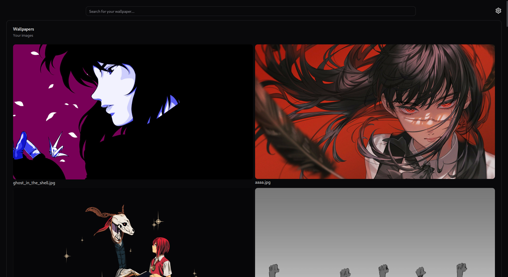

# WallpaperCL

**WallpaperCL** is a wallpaper manager application built with [Tauri](https://tauri.app/), designed to give you an easy way to organize and set your wallpapers on Linux systems.



## Features

- Lightweight and fast, built with Tauri for optimized performance.
- Easily manage your wallpapers and set them automatically on startup.
- Cross-platform support for Linux (with future plans for macOS and Windows).

## Installation

### Dependencies

Ensure you have the required dependencies installed. For Arch Linux users, you can install the following:

```bash
sudo pacman -S feh
```

### Download

Visit the [Releases Page](https://github.com/diegorezm/wallpapercl/releases) to download the latest version of WallpaperCL.

### Auto-set Wallpaper on Startup

To ensure your wallpaper is set on startup, add the following line to your `.xinitrc` file (assuming you use `xinit`):

```bash
$HOME/.fehbg
```

This will automatically apply the wallpaper using `feh` when you start your window manager.

## Development

If you wish to contribute or build WallpaperCL from source, follow these steps (for Arch Linux users):

1. Update your system:

   ```bash
   sudo pacman -Syu
   ```

2. Install the necessary dependencies:

   ```bash
   sudo pacman -S --needed \
       webkit2gtk \
       base-devel \
       curl \
       wget \
       file \
       openssl \
       appmenu-gtk-module \
       gtk3 \
       libappindicator-gtk3 \
       librsvg \
       libvips \
       feh
   ```

3. Clone the repository:

   ```bash
   git clone https://github.com/diegorezm/wallpapercl
   ```

4. Install Node.js dependencies and start the development environment:

   ```bash
   cd wallpapercl
   npm install
   npm run tauri dev
   ```

Now, you're ready to contribute or modify the application.
