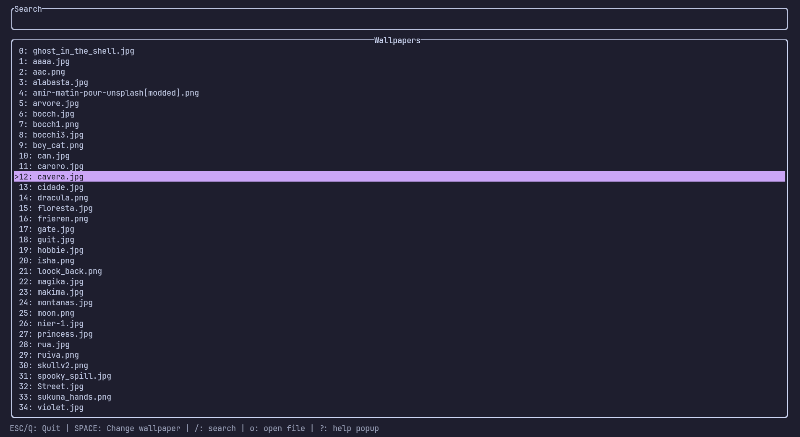

# Wallpapercl

This project was created because I wanted a way to manage my wallpapers from the terminal. It is primarily intended for use with tiling window managers.



## Colorscheme

It uses catppuccin mocha by default, but you can change the colors with Xresources. Here is an example:

```Xresources
#define walcl_background: #fbf1c7
#define walcl_foreground: #3c3836
#define walcl_primary: #b16286
#define walcl_subtext: #7c6f64

wallpapercl.background: walcl_background
wallpapercl.foreground: walcl_foreground
wallpapercl.primary: walcl_primary
wallpapercl.subtext: walcl_subtext
```
